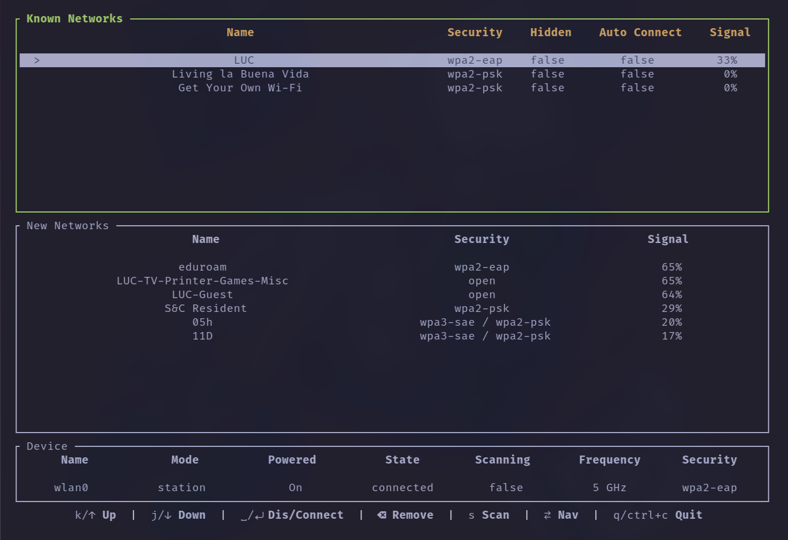

<div align="center">
  <h2> Netpala (Impala Go Edition) </h2>
</div>

A lightweight (hopefully) terminal-friendly NetworkManager + wpa_supplicant wrapper written in Go.
It’s a clone of Impala, because Impala’s UI made a single majestic white tear roll down my leg.

---

## 📸 Demo



---

## 💡 Prerequisites

A Linux-based OS with NetworkManager and dbus running.

---

## 🚀 Installation

### Binary Release

Pre-built binaries coming soon.

---

### Install from Source (Go)

```bash
git clone https://github.com/joel-sgc/netpala.git
cd netpala
go build
./netpala
```

You'll need:

- Go 1.25.1+
- NetworkManager running
- dbus available

---

### Omarchy / Hyprland launcher example

```bash
#!/bin/bash
exec setsid uwsm-app -- xdg-terminal-exec --app-id=com.omarchy.Impala -e ~/netpala/netpala \"$@\"
```

---

## 🪄 Usage

### Global

- Tab / Shift+Tab : Switch between sections
- j / Down : Scroll down
- k / Up : Scroll up
- s : Force scan
- q / Ctrl+C: Quit

### Networks

- Space / Enter : Connect / Disconnect
- Delete / Backspace : Remove network

---

## 🚀 Features (So Far)

- Lists available network devices
- Shows known and scanned networks
- Shows VPN connections
- Add & connect to:
  - WPA-PSK
  - WPA-SAE
  - WPA-Enterprise (EAP)
  - Open Networks
- Force network scan
- Enable/Disable devices
- Communicates with NetworkManager + wpa_supplicant over DBus

---

## ⚠️ Missing / TODO

- VPN manager UI (partially implemented but prone to crashes)
- Probably some bugs

---

## 🧩 Implementation Notes

The DBus code was mostly vibe-coded.
It works. I don’t care. If you do care, fork it and figure it out.

---

## 🧾 License

Do What the Fuck You Want To Public License (WTFPL)

---

## ❤️ Closing Thoughts

I built this for myself because I wanted something that just works, and this just works.
If you like it, awesome. If not, feel free to improve it or ignore it entirely.